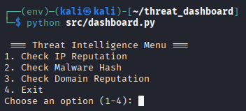
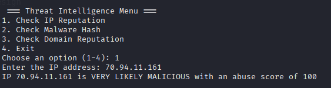
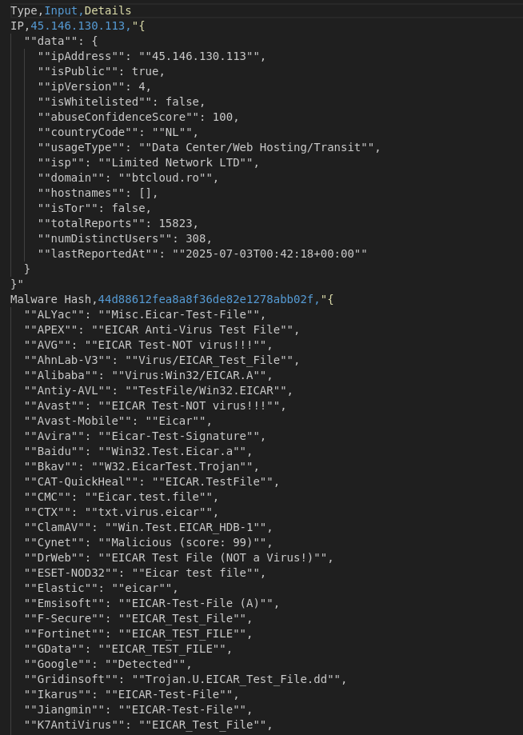
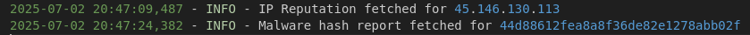

A terminal based tool for analyzing IP addresses, malware hashes, and domain reputations using public threat intelligence APIs

If you have any questions about using this threat dashboard, or just want to connect, feel free to reach out:

- [LinkedIn](https://www.linkedin.com/in/antonio-del-campo/)

#### Features

* Cross-platform (Works on Linux, Windows, and macOS)
* CLI-based dashboard with clean menu interface
* Real-time IP reputation checks via AbuseIPDB
* Malware hash scans through VirusTotal
* Domain reputation lookups via AlienVault OTX
* Auto-export results to clean CSV files
* Prints threat alerts directly to terminal
* Keeps user input clean and focused (only text accepted)
* Modular design

## Main Menu


## Threat Alert


## CSV Output 


## Logs Output


## Installation

This is a Python based CLI application - no installation required. Just follow the steps below:

```bash
git clone https://github.com/YOUR_USERNAME/threat-dashboard.git
cd threat-dashboard
python3 -m venv env
source env/bin/activate        # On Windows: .\env\Scripts\activate
pip install -r requirements.txt
```

Then, rename `config_sample.json` to `config.json`, and paste your own API keys like this:

```json
{
  "abuseipdb": "YOUR_ABUSEIPDB_KEY",
  "virustotal": "YOUR_VIRUSTOTAL_KEY",
  "alienvault": "YOUR_ALIENVAULT_KEY"
}
```

## Usage

Run the program using:

```bash
python src/dashboard.py
```

Follow the prompts:

1. Choose the scan type (IP, Hash, Domain)
2. Enter the input value when asked
3. Review results and alerts in the terminal
4. Exit to auto-save results

Output files:
- `data/threat_data.csv` – stores all scanned entries
- `logs/threat_dashboard.log` – records API and system activity

💡 If you see import warnings in VS Code, make sure your virtual environment is active and the Python interpreter is selected correctly.